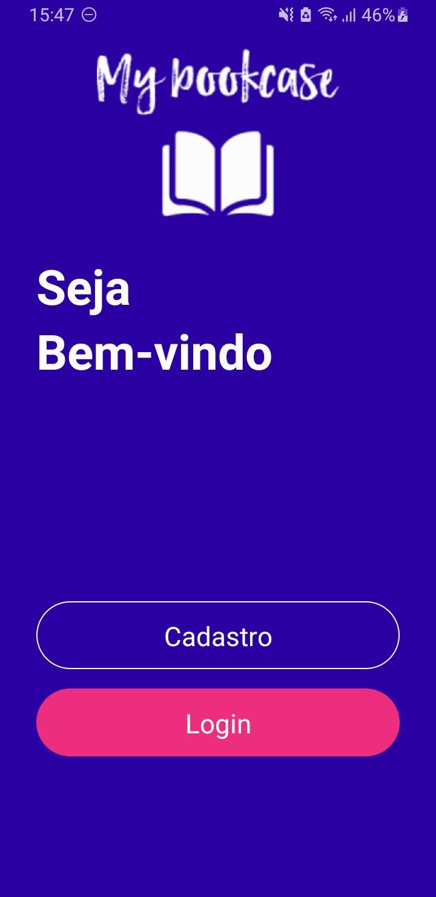
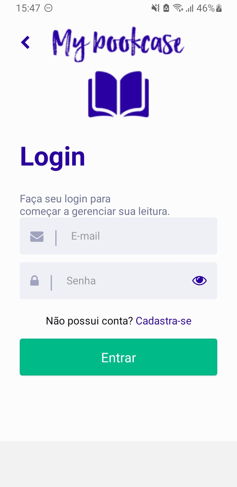
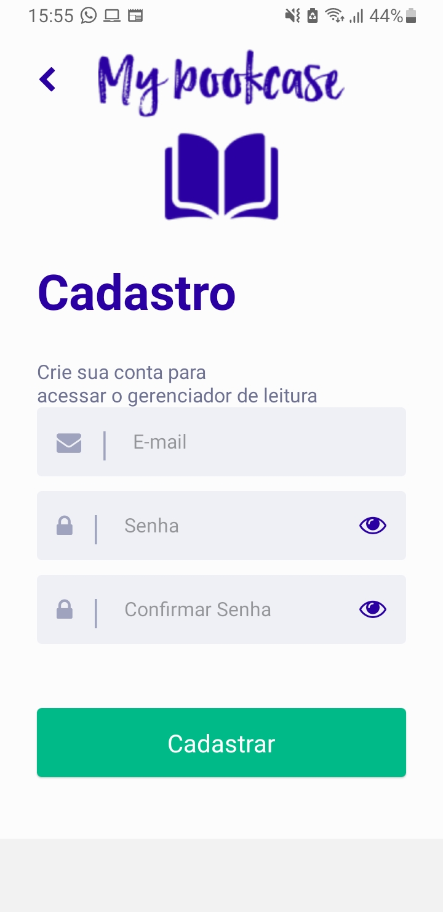
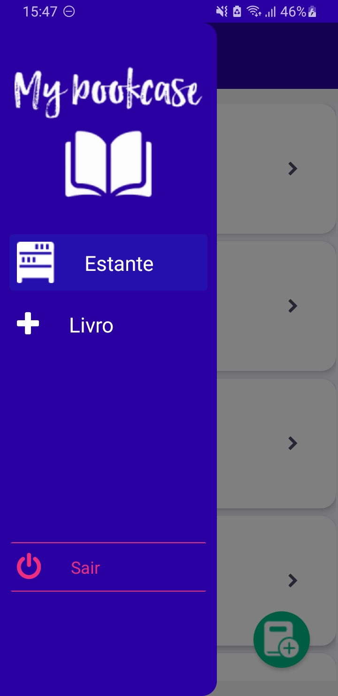
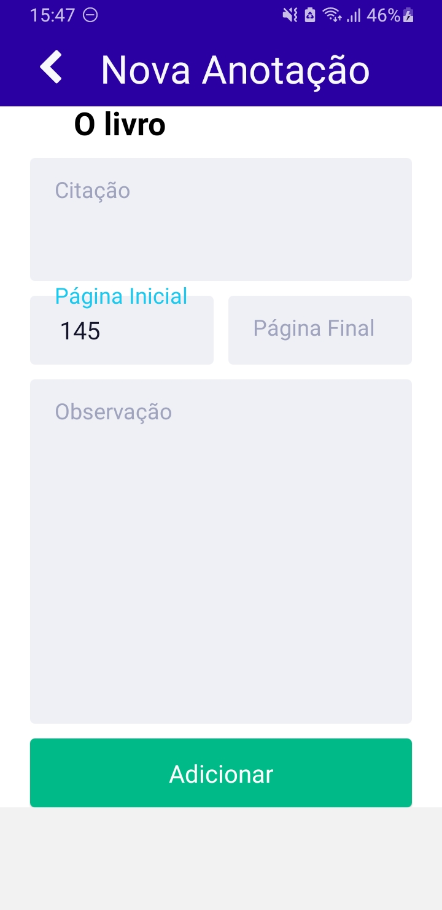
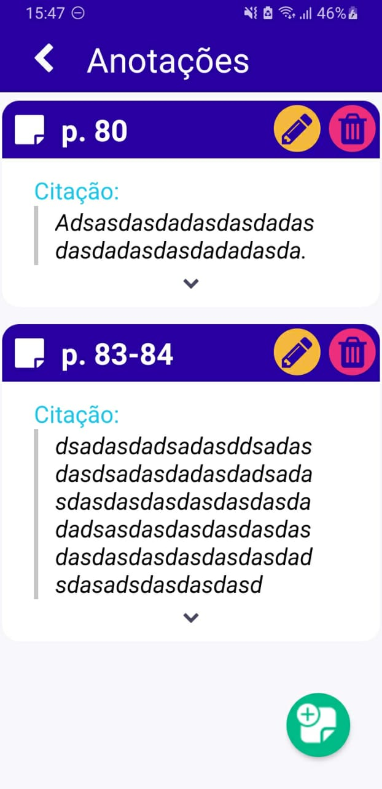
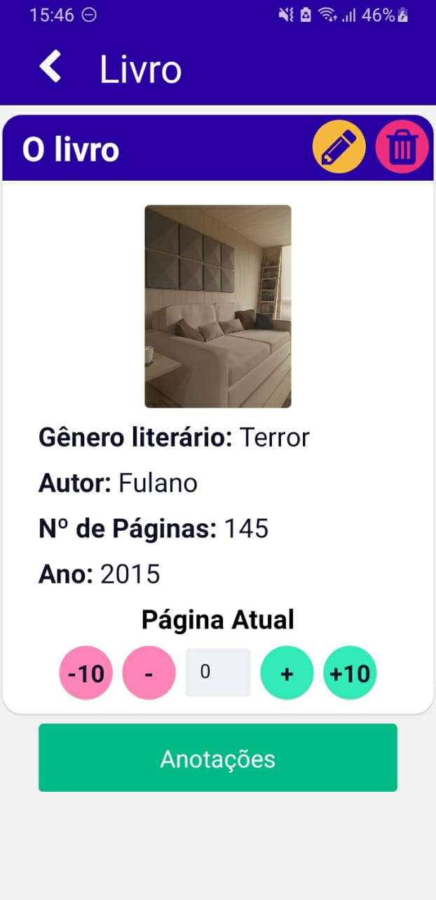
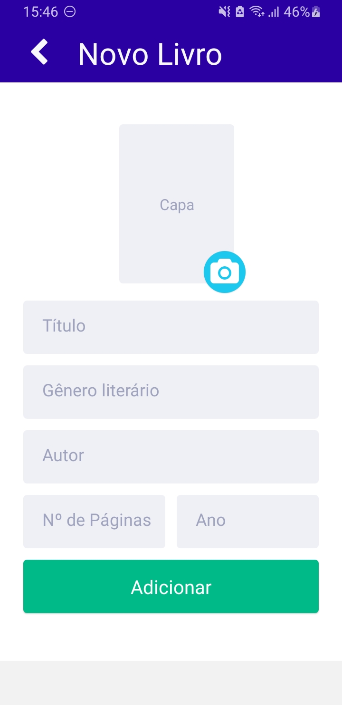
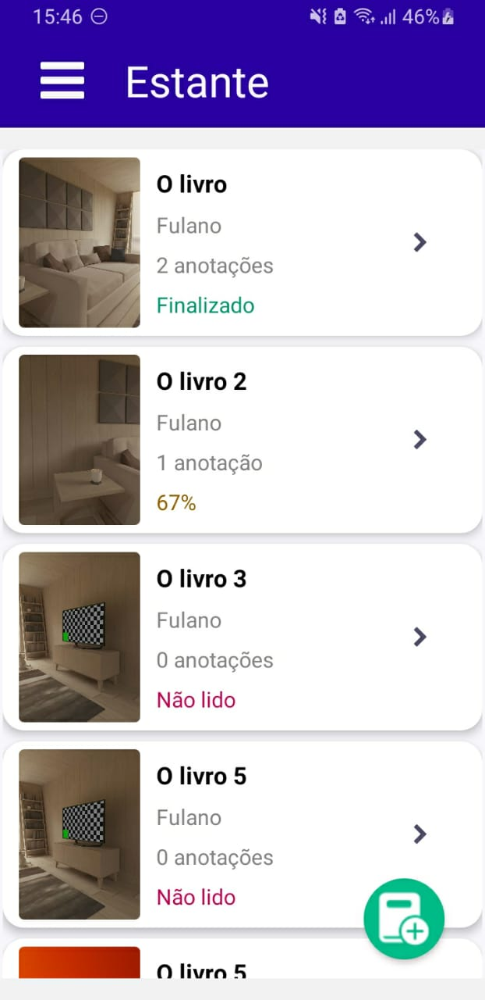

<h1 align="center">MyBookcase</h1>

## Sobre
Aplicação própria desenvolvida para a disciplina - Progamação Móvel. 

---

## Requisitos da atividade

### PROJETO -  Parte 1

- Uso de no mínimo 10 tipos de componentes de interface (Text, TextInput, Image, Button, ActivityIndicator, View, etc).
- Posicionamento/tamanho de componentes de interface (Bordas, tamanhos, margens)
- Criação e reuso de no mínimo 5 componentes próprios (ex.: Cartões, Item de Lista, Imagem customizada, etc)
- Tratamento de toques na tela 
- Navegação entre telas
- Renderização condicional
- Uso de DrawerNavigator na negação entre telas
- Aplicação de no mínimo 10 heurísticas de User Experience (UX)
- Login Firebase operacional
- Uso de no mínimo 5 ícones de outras fontes (FontAweSome, VectorIcons, NativePaper, etc)
- O protótipo mostra a integração de dados entre suas funcionalidades? 
- O protótipo apresenta as telas que envolvam no mínimo 2 CRUDS. Importante: cadastro de login/usuário 
- não entra nessa contabilização

### Projeto - Parte 2

- Login operacional (Firebase/SQLite ou outra tecnologia para persistência)
- Utilização do REDUX em no mínimo 2 entidades (tabelas do BD) 
- CRUD (inserção/create) - mínimo 2 tabelas do BD 
- CRUD (visualização/recovery) - mínimo 2 tabelas do BD 
- CRUD (atualização/update) - mínimo 2 tabelas do BD 
- CRUD (exclusão/delete) - mínimo 2 tabelas do BD
- Uso de FlatList - mínimo 2 tabelas do BD 
- Uso de câmera e/ou galeria 
- A aplicação atende a integração de dados entre suas funcionalidaes?

---

## Screenshots

<h1 align="center">
   
   
   
   
   
   
   
   
   
</h1>
